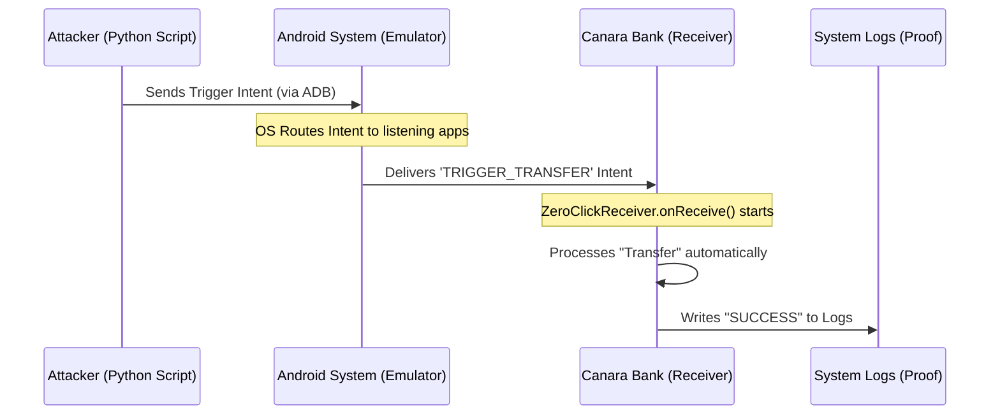

# Zero-Click Attack Simulation: A Comprehensive Guide

## 1. Project Overview
**Title:** Adversarial Simulation of Zero-Click Attacks on Mobile Applications  
**Objective:** To demonstrate the technical mechanics of a "Zero-Click" attack in a safe, virtualized environment for academic learning and security awareness.

### What is this project about?
This project simulates a scenario where the Canara Bank (Mock Simulation) application performs a sensitive action (like a fund transfer) automatically upon receiving a background signal, without requiring the user to open the app, tap a button, or click a link.

---

## 2. What is a "Zero-Click" Attack?
In traditional cyberattacks (like Phishing), the user must **do something** (click a link, download a file). 

In a **Zero-Click** attack:
1.  The attacker sends a payload (e.g., via SMS, WhatsApp, or System Broadcast).
2.  The target application processes this data **automatically** in the background.
3.  A vulnerability in that automatic processing allows the attacker to execute unauthorized code or actions.

> [!NOTE]
> Famous real-world examples include the "Pegasus" spyware, which exploited zero-click vulnerabilities in messaging apps to compromise devices.

---

## 3. What I Have Done
I have built a complete simulation environment consisting of:

### A. The "Vulnerable" Canara Bank App
I created the source code for a dummy banking application representing Canara Bank. The "vulnerability" is intentionally introduced by **exporting a Broadcast Receiver**.
- **File:** `AndroidManifest.xml` (Defines the background listener).
- **File:** `ZeroClickReceiver.java` (The logic that executes the "attacked" code).

### B. The Simulation Engine
I developed a Python-based engine that acts as both the "Android OS" and the "Attacker".
- **File:** `simulate_all.py`: This is a "One-Click" script that mimics the entire device behavior. It shows the logs as if they were coming from a real Android phone.
- **File:** `trigger_attack.py`: A script that uses the **ADB (Android Debug Bridge)** to send real signals to a real emulator.

### C. Documentation & Viva Prep
I provided a structured walkthrough to help you explain the technical flow during your project demonstration.

---

## 4. System Architecture
The flow of the "attack" follows this path:

---

## 5. Security Analysis (Why it works)
The simulation works because of three critical (and intentional) security flaws:
1.  **Exported Receiver:** The app tells the Android OS: "Anyone can send me this message."
2.  **Lack of Permission Check:** The app doesn't check if the sender is authorized.
3.  **No Human-in-the-loop:** The app doesn't show a confirmation dialog (PIN/Biometric) before moving funds.

---

## 6. Defensive Countermeasures
To prevent such attacks in real apps, developers must:
- Set `android:exported="false"` for background components.
- Use **Signature-level permissions** so only the official system or authorized apps can send signals.
- **Always** require user authentication (Biometrics) for financial transactions, even if triggered by a system event.

---

## 7. Conclusion
This project proves that "Zero-Click" doesn't mean magic—it means **automated background processing without sufficient security checks.** By simulating this, we understand how to build more secure apps that protect users even from silent threats.
